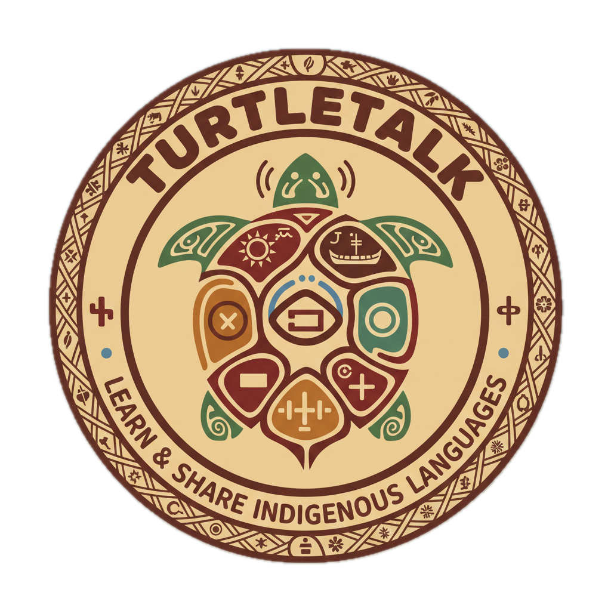

# 🐢 TurtleTalk - AI-Powered Indigenous Language Learning Platform

<div align="center">



**Preserving Indigenous languages through AI-powered interactive learning**

[](LICENSE)
[](https://reactjs.org/)
[](https://fastapi.tiangolo.com/)
[](https://www.python.org/)
[](https://www.typescriptlang.org/)

[Features](#-features) • [Demo](#-demo) • [Getting Started](#-getting-started) • [Tech Stack](#-tech-stack) • [Documentation](#-documentation)

</div>

---

## 📖 About

TurtleTalk is an innovative AI-powered platform designed to preserve and teach Indigenous languages across North America. The platform combines modern technology with cultural sensitivity to create an engaging, accessible learning experience through:

- 🎯 **Interactive Duolingo-style exercises** with real-time feedback
- 🎤 **AI-powered pronunciation evaluation** using Google Gemini
- 🔊 **Natural-sounding text-to-speech** with VITS neural audio generation
- 📚 **Comprehensive course system** with progressive difficulty levels
- 🌐 **Community-driven content** and cultural storytelling
- ♿ **Accessibility-first design** with screen reader support

Built for **HackHive 2026**, TurtleTalk demonstrates how technology can support Indigenous language revitalization while respecting cultural context and community needs. Currently showcasing Cree language education with plans to expand to additional Indigenous languages.

## ✨ Features

### 🎓 Learning Experience
- **Progressive Course System**: Structured lessons from beginner to advanced levels
- **Interactive Exercises**: Multiple choice, translation, pronunciation, and listening comprehension
- **Real-time Pronunciation Feedback**: AI analyzes your pronunciation and provides specific improvement tips
- **Audio-First Learning**: High-quality Indigenous language audio recordings for authentic pronunciation
- **Cultural Context**: Stories and examples rooted in Indigenous cultures

### 🤖 AI Integration
- **Gemini API Pronunciation Analysis**: Advanced AI evaluates pronunciation accuracy (0-100 score)
- **Personalized Feedback**: Specific tips on pronunciation, intonation, and cultural nuances
- **VITS Text-to-Speech**: Neural network generates natural-sounding Indigenous language speech
- **Smart Progress Tracking**: Adaptive learning based on user performance

### 🌍 Community Features
- **Cultural Stories**: Interactive storytelling in Cree with translations
- **Language Exchange**: Connect with native speakers and learners
- **Community Forums**: Discussion spaces for language and culture
- **Translation Collaboration**: Community-driven translation projects
- **Cultural Events**: Virtual and in-person Indigenous cultural events

### ♿ Accessibility
- **Screen Reader Support**: Full ARIA compliance for visually impaired users
- **Keyboard Navigation**: Complete keyboard-only navigation support
- **Adjustable Text Size**: Customizable font sizes for better readability
- **High Contrast Mode**: Enhanced visibility options
- **Audio Descriptions**: Comprehensive audio feedback for all interactions

## 🎬 Demo

### Pronunciation Exercise
Students record themselves speaking Indigenous language phrases and receive instant AI feedback:
- **Score**: 0-100 pronunciation accuracy
- **Feedback**: Detailed analysis of strengths and areas for improvement
- **Tips**: Specific guidance on proper pronunciation techniques
- **Cultural Notes**: Context about the phrase and its cultural significance

### Interactive Lessons
Duolingo-style learning flow with:
- Multiple exercise types (listening, speaking, translation)
- Progress tracking with visual feedback
- Immediate correction and explanation
- Audio playback of correct pronunciation

## 🚀 Getting Started

### Prerequisites

- **Node.js** 18+ and npm
- **Python** 3.9+
- **SQLite** (included) or PostgreSQL
- **Git**

### Quick Start

1. **Clone the repository**
   ```bash
   git clone https://github.com/Mayalevich/TurtleTalk.git
   cd TurtleTalk
   ```

2. **Frontend Setup**
   ```bash
   cd frontend
   npm install
   npm start
   ```
   Frontend runs on `http://localhost:3000`

3. **Backend Setup** (new terminal)
   ```bash
   cd backend
   pip install -r requirements.txt
   
   # Set up environment variables
   cp .env.example .env
   # Edit .env with your Gemini API key
   
   # Run the server
   python run.py
   ```
   Backend runs on `http://localhost:3001`

4. **Access the app**
   Open `http://localhost:3000` in your browser

### Environment Variables

Create a `.env` file in the `backend/` directory:

```env
# Database
DATABASE_URL=sqlite:///./turtletalk.db

# Google Gemini API
GEMINI_API_KEY=your_gemini_api_key_here

# JWT Secret
SECRET_KEY=your-secret-key-here
```

## 🛠 Tech Stack

### Frontend
- **React 18** with TypeScript
- **Material-UI v5** - Modern component library
- **Web Audio API** - Audio recording and playback
- **MediaRecorder API** - Browser-based audio capture
- **React Router** - Client-side routing
- **Context API** - State management

### Backend
- **FastAPI** - High-performance Python web framework
- **SQLAlchemy** - ORM for database operations
- **SQLite/PostgreSQL** - Relational database
- **Google Gemini API** - AI pronunciation evaluation
- **JWT Authentication** - Secure user sessions
- **Pydantic** - Data validation

### ML/Audio Services
- **VITS** - Neural text-to-speech for Indigenous languages
- **Google Gemini 1.5 Flash** - Multimodal AI for pronunciation analysis
- **Whisper AI** (Planned) - Conversational AI tutor for interactive dialogue
- **Speech-to-Text** (Prototype) - Voice recognition for Indigenous languages
- **Audio Processing** - WAV file generation and manipulation

### Prototypes & Research
- **Speech-to-Text Model** - Completed prototype for voice recognition
  - Designed for Indigenous language phonetics
  - Integration planned for future releases
  - Enables conversational practice features

### DevOps & Tools
- **Git** - Version control
- **GitHub** - Code hosting
- **npm** - Package management
- **pip** - Python package management

## 📚 Documentation

### Core Documentation
- **[SETUP.md](./SETUP.md)** - Complete development environment setup
- **[ARCHITECTURE.md](./ARCHITECTURE.md)** - System design and component interactions
- **[TECHNICAL_SPEC.md](./TECHNICAL_SPEC.md)** - API contracts and data formats

### Developer Guides
- **[FRONTEND_PLAN.md](./FRONTEND_PLAN.md)** - Frontend development roadmap
- **[BACKEND_PLAN.md](./BACKEND_PLAN.md)** - Backend development roadmap
- **[ML_PLAN.md](./ML_PLAN.md)** - ML/AI development roadmap

### Testing & Integration
- **[INTEGRATION_TESTING.md](./INTEGRATION_TESTING.md)** - Comprehensive integration tests
- **[QUICK_TEST_GUIDE.md](./QUICK_TEST_GUIDE.md)** - Quick testing reference
- **[BACKEND_TESTING_QUICKSTART.md](./BACKEND_TESTING_QUICKSTART.md)** - Backend testing guide

### Community & Demo
- **[COMMUNITY_DEMO_GUIDE.md](./COMMUNITY_DEMO_GUIDE.md)** - Hackathon demo instructions
- **[TURTLETALK_PRD.md](./TURTLETALK_PRD.md)** - Product requirements document

## 🏗 Project Structure

```
TurtleTalk/
├── frontend/              # React TypeScript application
│   ├── public/
│   │   ├── audio/        # Indigenous language audio files (VITS-generated)
│   │   └── images/       # Assets and course thumbnails
│   └── src/
│       ├── components/   # React components
│       ├── contexts/     # React context providers
│       ├── services/     # API services
│       └── types/        # TypeScript definitions
│
├── backend/              # FastAPI Python server
│   ├── app/
│   │   ├── models/      # Database models
│   │   ├── routes/      # API endpoints
│   │   ├── schemas/     # Pydantic schemas
│   │   └── services/    # Business logic
│   ├── alembic/         # Database migrations
│   └── scripts/         # Utility scripts
│
├── ml-service/          # Machine learning services
│   ├── vits_main.py    # VITS TTS service
│   └── config.json     # ML model configuration
│
└── tests/              # Integration tests
    └── integration/    # API contract tests
```

## 🎯 Key Features Implemented

### ✅ Completed Features
- [x] User authentication and profile management
- [x] Course module system with progressive lessons
- [x] Interactive pronunciation exercises
- [x] AI pronunciation evaluation with Gemini API
- [x] Audio recording and playback
- [x] Real-time feedback with 4-second display
- [x] VITS text-to-speech for Indigenous languages
- [x] Community forums and discussion spaces
- [x] Cultural storytelling section
- [x] Accessibility features (screen reader, keyboard nav)
- [x] Progress tracking and achievements
- [x] SQLite database with migration support

### 🚧 In Progress
- [ ] Full Gemini API integration for context-aware feedback
- [ ] PostgreSQL production database setup
- [ ] Advanced progress analytics dashboard
- [ ] Mobile responsive design enhancements
- [ ] Offline mode with service workers

### 🔮 Future Enhancements
- [ ] **Whisper AI Integration** - Conversational AI tutor with natural dialogue
- [ ] **Speech-to-Text Model** - Real-time voice recognition (prototype completed)
- [ ] **Interactive Voice Conversations** - Back-and-forth dialogue practice with AI tutor
- [ ] Additional Indigenous languages support (Ojibwe, Mohawk, Inuktitut, etc.)
- [ ] Mobile native apps (iOS/Android)
- [ ] Live video sessions with native speakers
- [ ] Gamification with leaderboards
- [ ] AI-generated personalized learning paths
- [ ] Voice recognition for conversational practice

## 🤝 Contributing

We welcome contributions from developers, linguists, and Indigenous community members! Please see our contributing guidelines:

1. Fork the repository
2. Create a feature branch (`git checkout -b feature/AmazingFeature`)
3. Commit your changes (`git commit -m 'Add some AmazingFeature'`)
4. Push to the branch (`git push origin feature/AmazingFeature`)
5. Open a Pull Request

### Development Guidelines
- Follow TypeScript and Python best practices
- Write tests for new features
- Respect cultural sensitivity in language content
- Ensure accessibility compliance
- Document API changes

## 📄 License

This project is licensed under the MIT License - see the [LICENSE](LICENSE) file for details.

## 👥 Team

Built with ❤️ for HackHive 2026

- **Project Lead & Full Stack Development**
- **AI/ML Integration**
- **Cultural Consultation & Content**

## 🙏 Acknowledgments

- **Indigenous Language Elders** for their guidance and cultural knowledge
- **HackHive 2026** for hosting the hackathon
- **Google Gemini API** for AI pronunciation evaluation
- **OpenAI Whisper** for speech recognition capabilities
- **VITS Team** for the text-to-speech model
- **Indigenous communities** for their support and feedback

## 📞 Contact

- **GitHub**: [@Mayalevich](https://github.com/Mayalevich)
- **Project Repository**: [TurtleTalk](https://github.com/Mayalevich/TurtleTalk)
- **Issues**: [Report a Bug](https://github.com/Mayalevich/TurtleTalk/issues)

---

<div align="center">

**Made with 🐢 for Indigenous language preservation**

[⬆ Back to Top](#-turtletalk---ai-powered-indigenous-language-learning-platform)

</div>

